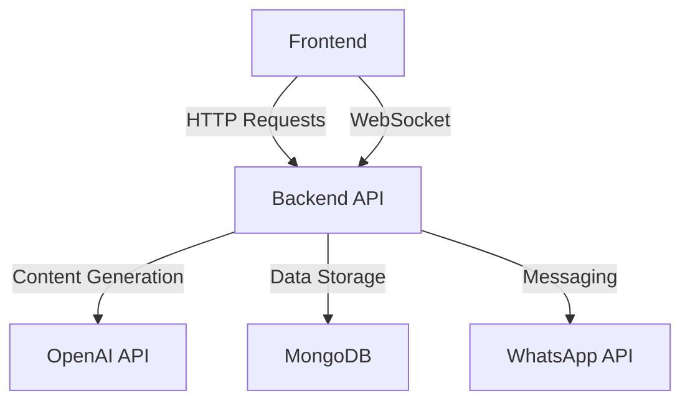
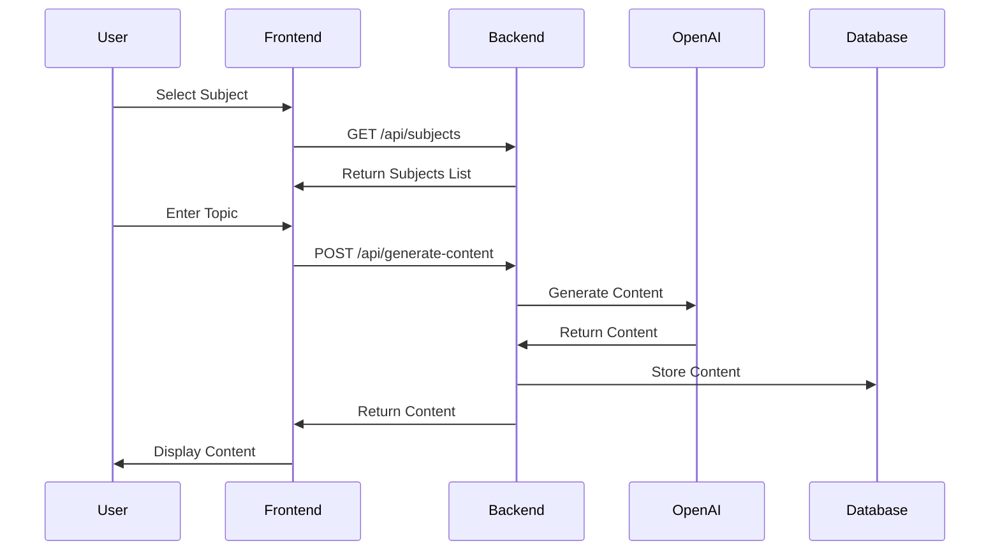
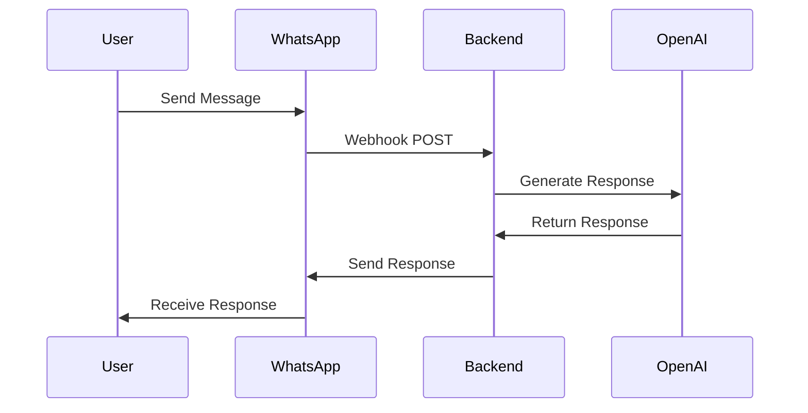
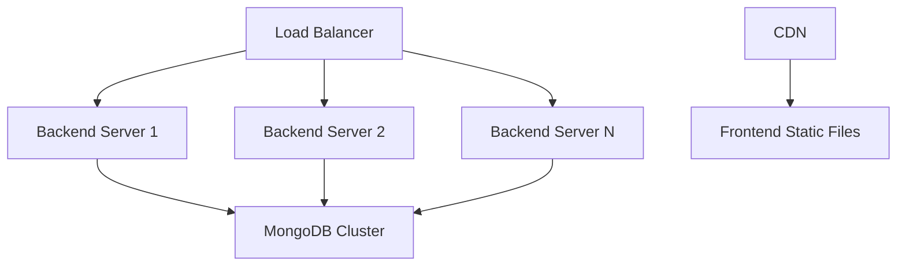

# TAPBuddy System Design

## System Architecture

### Overview
TAPBuddy is an AI-powered learning assistant that provides personalized educational content across multiple subjects. The system consists of three main components:

1. Frontend (React + TypeScript)
2. Backend (Flask + Python)
3. Database (MongoDB)

### Component Architecture

### Detailed Component Breakdown

#### 1. Frontend (React + TypeScript)
- **Framework**: React 18 with TypeScript
- **UI Library**: Material-UI (MUI)
- **State Management**: React Hooks
- **Routing**: React Router v6
- **API Communication**: Axios

Key Components:
- `App.tsx`: Main application component with routing
- `Layout.tsx`: Common layout wrapper
- `Home.tsx`: Subject selection page
- `Subject.tsx`: Chat interface for each subject

#### 2. Backend (Flask + Python)
- **Framework**: Flask 2.3.3
- **API Documentation**: Swagger/OpenAPI
- **CORS**: flask-cors
- **Environment**: python-dotenv

Key Modules:
- `app.py`: Main application entry point
- `modules/content_generator.py`: AI content generation
- `modules/whatsapp.py`: WhatsApp integration
- `modules/database.py`: Database operations

#### 3. Database (MongoDB)
- **Driver**: PyMongo
- **Collections**:
  - `content`: Stores generated educational content
  - `users`: User profiles and preferences
  - `sessions`: Chat session history

## Workflow

### 1. User Interaction Flow

### 2. Content Generation Flow

1. **Request Processing**:
   - Frontend sends subject and topic
   - Backend validates input
   - Backend checks cache for existing content

2. **Content Generation**:
   - If not in cache, call OpenAI API
   - Process and format response
   - Store in database
   - Return to frontend

3. **Error Handling**:
   - Input validation
   - API error handling
   - Rate limiting
   - Fallback responses

### 3. WhatsApp Integration Flow

## API Endpoints

### Frontend-Backend Communication

1. **Content Generation**
   - `POST /api/generate-content`
   - Request: `{ subject: string, topic: string, difficulty: string }`
   - Response: `{ success: boolean, content: string, content_id: string }`

2. **Content Retrieval**
   - `GET /api/content/<content_id>`
   - Response: `{ success: boolean, content: object }`

3. **WhatsApp Webhook**
   - `POST /api/whatsapp/webhook`
   - Request: WhatsApp message payload
   - Response: Processed message response

## Security Considerations

1. **Authentication & Authorization**
   - JWT-based authentication
   - Role-based access control
   - API key management

2. **Data Protection**
   - Environment variable management
   - Secure API key storage
   - Input sanitization
   - CORS configuration

3. **Rate Limiting**
   - Per-user rate limiting
   - API endpoint rate limiting
   - DDoS protection

## Scalability Considerations

1. **Horizontal Scaling**
   - Stateless backend design
   - Load balancing
   - Database sharding

2. **Caching Strategy**
   - Content caching
   - Session caching
   - API response caching

3. **Monitoring & Logging**
   - Application metrics
   - Error tracking
   - Performance monitoring

## Deployment Architecture

## Future Enhancements

1. **Features**
   - User authentication
   - Progress tracking
   - Content recommendations
   - Multi-language support

2. **Technical**
   - WebSocket for real-time updates
   - GraphQL API
   - Microservices architecture
   - Containerization with Docker

3. **Integration**
   - Additional messaging platforms
   - Learning management systems
   - Analytics integration
   - Payment processing 